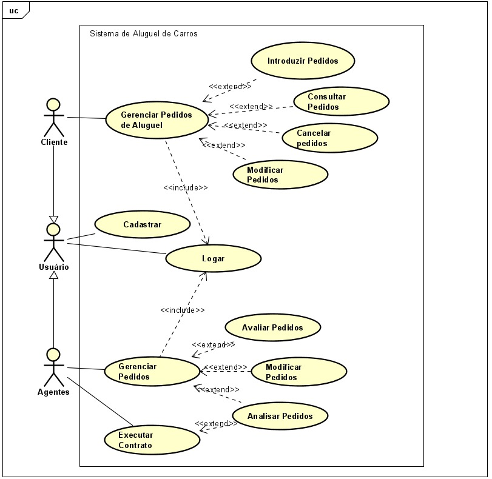
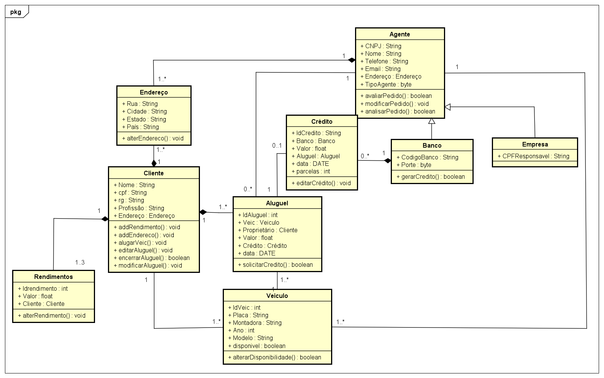
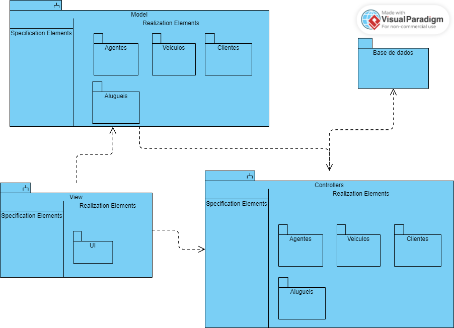

# Sistema de Aluguel de Carros

## Histórias de Usuário

## US1. *Cadastro de Usuário - Cliente*
*Como* um cliente,  
*Eu quero* me cadastrar no sistema com meus dados pessoais,  
*Para que* eu possa acessar as funcionalidades de aluguel de automóveis.

### Critérios de Aceitação:
- O sistema deve solicitar os dados de identificação (RG, CPF, Nome, Endereço) e informações profissionais.
- O sistema deve permitir o cadastro de até três entidades empregadoras e respectivos rendimentos.
- O sistema deve notificar o cliente do sucesso ou falha do cadastro.

## US2. *Cadastro de Usuário - Agente (Empresa ou Banco)*
*Como* um agente (empresa ou banco),  
*Eu quero* me cadastrar no sistema com os dados da minha empresa,  
*Para que* eu possa modificar e avaliar pedidos de aluguel de automóveis.

### Critérios de Aceitação:
- O sistema deve solicitar dados da empresa ou banco (CNPJ, nome da entidade, endereço e informações financeiras).
- O sistema deve notificar o agente sobre o sucesso ou falha no cadastro.

## US3. *Login no Sistema*
*Como* um usuário cadastrado (cliente ou agente),  
*Eu quero* fazer login no sistema,  
*Para que* eu possa acessar minhas funcionalidades específicas de cliente ou agente.

### Critérios de Aceitação:
- O sistema deve validar as credenciais de login (CPF/CNPJ e senha).
- O sistema deve redirecionar o usuário para as funcionalidades adequadas (cliente ou agente) após login bem-sucedido.
- O sistema deve mostrar mensagens de erro adequadas em caso de falha no login.

## US4. *Fazer Pedido de Aluguel de Automóvel - Cliente*
*Como* um cliente,  
*Eu quero* fazer um pedido de aluguel de um automóvel,  
*Para que* eu possa alugar um carro por um período determinado.

### Critérios de Aceitação:
- O sistema deve permitir que o cliente selecione um automóvel (matrícula, ano, marca, modelo e placa).
- O sistema deve permitir que o cliente defina o período de aluguel.
- O sistema deve notificar o cliente sobre a submissão bem-sucedida do pedido.

## US5. *Modificar Pedido de Aluguel - Cliente*
*Como* um cliente,  
*Eu quero* modificar um pedido de aluguel existente,  
*Para que* eu possa alterar as informações antes de o contrato ser executado.

### Critérios de Aceitação:
- O sistema deve permitir que o cliente modifique as informações do pedido (carro, período, etc.) antes da aprovação.
- O sistema deve confirmar as alterações feitas pelo cliente.
- O sistema deve notificar o cliente sobre a modificação bem-sucedida do pedido.

## US6. *Cancelar Pedido de Aluguel - Cliente*
*Como* um cliente,  
*Eu quero* cancelar um pedido de aluguel,  
*Para que* eu não seja cobrado ou vinculado a um contrato desnecessário.

### Critérios de Aceitação:
- O sistema deve permitir que o cliente cancele pedidos que ainda não foram aprovados ou executados.
- O sistema deve exibir uma mensagem de confirmação antes de efetivar o cancelamento.
- O sistema deve notificar o cliente sobre o sucesso ou falha do cancelamento.

## US7. *Avaliar Pedido de Aluguel - Agente*
*Como* um agente,  
*Eu quero* avaliar os pedidos de aluguel submetidos pelos clientes,  
*Para que* eu possa aprovar ou rejeitar os pedidos com base na análise financeira.

### Critérios de Aceitação:
- O sistema deve listar os pedidos pendentes para o agente.
- O agente deve ter acesso aos detalhes financeiros e profissionais do cliente para análise.
- O sistema deve permitir que o agente aprove ou rejeite o pedido, justificando a decisão.
- O sistema deve notificar o cliente da decisão do agente.

## US8. *Execução de Contrato de Aluguel - Cliente*
*Como* um cliente,  
*Eu quero* finalizar e executar o contrato de aluguel,  
*Para que* eu possa utilizar o automóvel após a aprovação do pedido.

### Critérios de Aceitação:
- O sistema deve exibir o contrato final ao cliente para revisão e assinatura eletrônica.
- O cliente deve poder aceitar os termos do contrato para que o aluguel seja efetivado.
- O sistema deve notificar o cliente e o agente sobre a execução bem-sucedida do contrato.

## US9. *Consultar Status do Pedido - Cliente*
*Como* um cliente,  
*Eu quero* consultar o status do meu pedido de aluguel,  
*Para que* eu possa acompanhar o andamento e as aprovações necessárias.

### Critérios de Aceitação:
- O sistema deve exibir o status atual do pedido (pendente, em análise, aprovado, cancelado, etc.).
- O cliente deve ser notificado automaticamente de qualquer mudança de status.

## US10. *Cadastro de Automóveis - Agente*
*Como* um agente,  
*Eu quero* cadastrar os automóveis disponíveis para aluguel,  
*Para que* os clientes possam selecionar os carros durante a criação de pedidos.

### Critérios de Aceitação:
- O sistema deve permitir que o agente cadastre novos automóveis com matrícula, ano, marca, modelo e placa.
- O agente deve poder modificar ou remover carros do sistema.
- O sistema deve notificar o agente sobre o sucesso ou falha no cadastro de novos veículos.

## Diagrama de Casos de Uso

## Diagrama de Classes

## Diagrama de Pacotes

